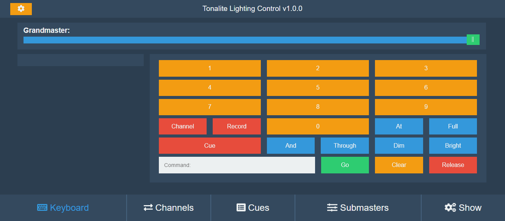

# Tonalite v1.0.0

Tonalite is a mobile E.131 lighting controller written in Python and JavaScript using SocketIO. It's current configuration is 48 channels so as to keep overhead low, but this can be increased if needed.

This project uses the Semantic Versioning 2.0.0 system.

## Required Tools

Tonalite requires Python 3.6+, SASS, and the folowing libraries:

- python-socketio
- aiohttp
- PyInstaller
- passlib
- cython

## Run Tonalite

To run Tonalite, use the command `python3 tonalite.py`

## Create Executable

Build channelman and create the PyInstaller release executable by running the command `build.bat`

If you have [UPX](https://upx.github.io/) installed, the output will be much faster and smaller. Please note that it is currently disabled due to a Windows build bug.

## Feature Set

- [x] Save/load show
- [x] Record and playback cues
- [x] Change cue time
- [x] Follow cue
- [x] Submasters
- [x] Security and login
- [ ] Effects