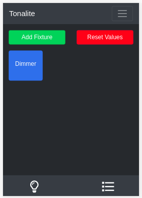
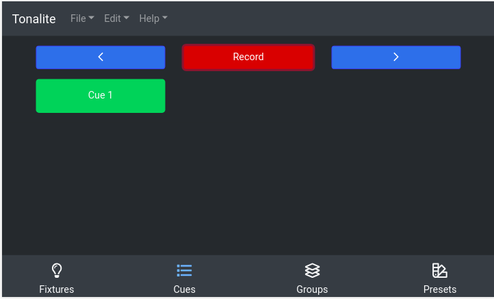

# Tonalite 2.0




Tonalite is a lighting control software that runs over the network. You can access the control panel from any network-connected device. While there are more features coming soon, the available ones are listed below:

- Add fixtures and map them to DMX addresses
- Control the value of each fixture's channels
- Add cues and cycle through them

Tonalite currently works with the `ArtNet`, `E1.31 (sACN)`, and `uDMX (using ArtNet)` DMX protocols.

## Run

To start Tonalite locally, run `node index.js`

You will find the UI at `localhost:3000` by default.

## Build

To build Tonalite, run `npm run build-(win/mac/linux)`

To generate the documentation run `cd docs && gitbook pdf . documentation.pdf`

## Dependency Instructions

You need `NodeJS` installed. You also need `Calibre` if you want to generate the PDF documentation.

https://www.illutzmination.de/udmxartnet.html?&L=1

## Setting Up a Raspberry Pi Zero W

Flash raspbian onto the sd card and leave it connected to the linux computer.

### On the linux computer

Go to the root folder of the flashed sd card.

`touch ssh`

`sudo nano wpa_supplicant.conf`

with the content

```
country=US
ctrl_interface=DIR=/var/run/wpa_supplicant GROUP=netdev
update_config=1

network={
    ssid="NETWORK-NAME"
    psk="NETWORK-PASSWORD"
}
```

Eject the sd card, insert it into the RPIZW and boot it up.

Wait about 90 seconds.

`ssh-keygen -R raspberrypi.local`

`ssh pi@raspberrypi.local`

### On the RPIZW

`sudo apt-get update`

`sudo apt-get upgrade`

`sudo apt-get install dnsmasq hostapd git`

`curl -o node-v11.0.0-linux-armv6l.tar.xz https://nodejs.org/dist/v11.0.0/node-v11.0.0-linux-armv6l.tar.xz`

`tar -xf node-v11.0.0-linux-armv6l.tar.xz`

`sudo cp -r node-v11.0.0-linux-armv6l/* /usr/local/`

`git clone https://github.com/johnroper100/Tonalite.git`

`cd Tonalite`

`/usr/local/bin/npm install`

`sudo nano index.js`

and change `DEVICE` to `1`

`sudo systemctl stop dnsmasq`

`sudo systemctl stop hostapd`

`sudo reboot`

`sudo nano /etc/dhcpcd.conf`

add the following content to the end of the file

```
interface wlan0
    static ip_address=192.168.4.1/24
    nohook wpa_supplicant
```

Shut down the raspberry pi and reinser the sd card into the linux computer.

### Back on the linux machine

Navigate to the rootfs folder of the flashed sd card.

`sudo mv etc/dnsmasq.conf etc/dnsmasq.conf.orig`

`sudo nano etc/dnsmasq.conf`

with the content

```
interface=wlan0      # Use the require wireless interface - usually wlan0
  dhcp-range=192.168.4.2,192.168.4.20,255.255.255.0,24h
```

`sudo nano etc/hostapd/hostapd.conf`

with the content

```
interface=wlan0
driver=nl80211
ssid=Tonalite
hw_mode=g
channel=7
wmm_enabled=0
macaddr_acl=0
auth_algs=1
ignore_broadcast_ssid=0
wpa=2
wpa_passphrase=xbhs2020
wpa_key_mgmt=WPA-PSK
wpa_pairwise=TKIP
rsn_pairwise=CCMP
```

`sudo nano etc/default/hostapd`

replace the line with `#DAEMON_CONF` with: `DAEMON_CONF="/etc/hostapd/hostapd.conf"`

`sudo nano etc/rc.local`

and add

```
sudo systemctl start hostapd
sudo systemctl start dnsmasq
```

right before `exit 0`

Remove the sd card and reinsert it into the RPIZW.

give the RPIZW about 90 seconds to start, and then check for wifi networks. The `Tonalite` should show up. Connect to the network.

`ssh pi@raspberrypi.local`

### Back on the RPIZW

`sudo nano /etc/rc.local`

and remove

```
sudo systemctl start hostapd
sudo systemctl start dnsmasq
```
and add 

```
/usr/local/bin/npm start --prefix /home/pi/Tonalite &
```

right before `exit 0`

`sudo nano Tonalite/index.js`

and change `URL` to `"192.168.4.1"`