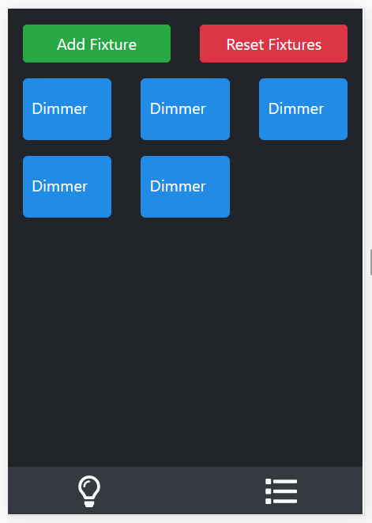

# Tonalite 2.0

Tonalite is still very WIP! This is a rewrite of the old version (found in the `old` folder of this repo). Not all features have been written yet. More coming soon.

## Run

To start Tonalite locally, run `node index.js`

You will find the UI at `localhost:3000` by default.

## Build

To build Tonalite, run `npm run build-(win/mac/linux)`

## Dependency Instructions

http://dhocker.github.io/posts/2016/05/20/anyma-udmx.html