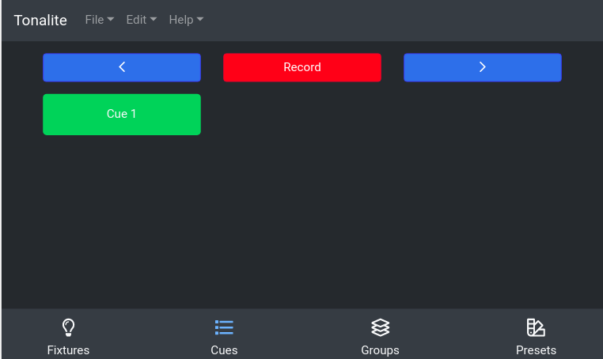
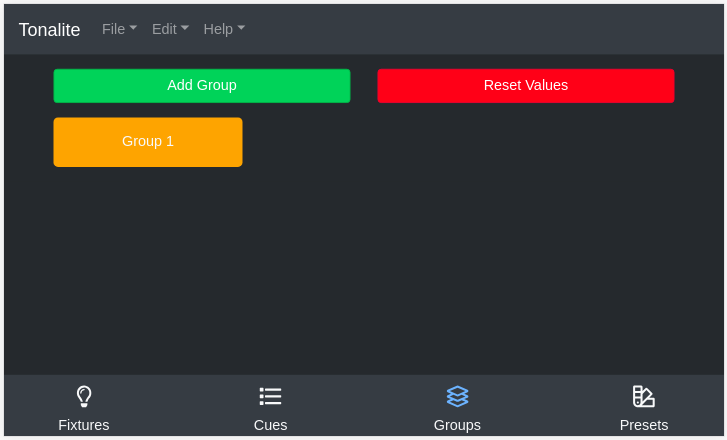
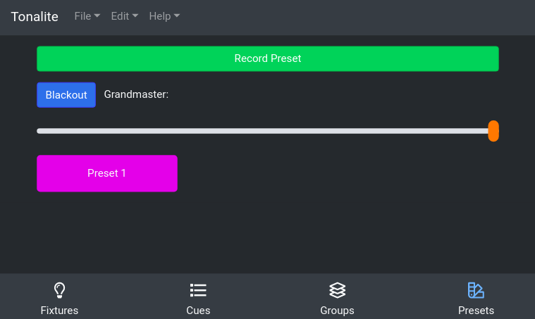

# Tonalite v2.0.0 Beta 5 

[View Current Documentation](docs/documentation.pdf)

Tonalite is lighting control software that uses a web interface accessible from any device on the network such as a phone, tablet, or laptop. While there are more features coming soon, Tonalite can currently:

- Add fixtures and map them to DMX addresses
- Control the value of each fixture's parameters (attributes)
- Add cues and cycle through them
- Add groups to control multiple fixtures at once
- Record presets for easy system overrides
- Support RGB and moving lights
- Support automark
- Support ETC's fixture profile format
- Add and control effects on fixtures
  
All these features make Tonalite a direct competetor to other well-known theater lighting consoles.

Tonalite currently works with `ArtNet`, `E1.31 (sACN)`, and `uDMX (using uDMXArtNet)` interfaces.

You can read the full documentation [here](docs/documentation.pdf).

## Run

Install the uDMX rules (if using uDMX): `sudo cp 98-uDMX.rules /etc/udev/rules.d`

To start Tonalite locally, run `npm start`

You will find the UI at `localhost:3000` by default.

## Build

To build Tonalite, run `npm run build-(linux/win/macos)`

To generate the documentation run `npm run build-docs` and `npm run build-docs-pdf`

## Dependency Instructions

You need `NodeJS` and `gitbook-cli` installed. You also need `Calibre` if you want to generate the PDF documentation.

## Resources

https://www.illutzmination.de/udmxartnet.html?&L=1

https://github.com/dhocker/udmx-pyusb

https://obrienlabs.net/setup-raspberry-pi-kiosk-chromium/

https://scribles.net/customizing-boot-up-screen-on-raspberry-pi/

https://ubuntuforums.org/showthread.php?t=1935099

https://raspberrypi.stackexchange.com/questions/66169/auto-mount-usb-stick-on-plug-in-without-uuid
