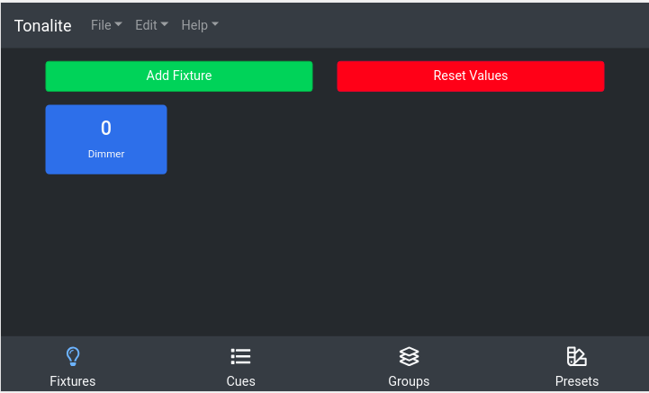

# Tonalite 2.0

Tonalite is a lighting control software that runs over the network. You can access the control panel from any network-connected device. While there are more features coming soon, the available ones are listed below:

- Add fixtures and map them to DMX addresses
- Control the value of each fixture's channels
- Add cues and cycle through them

Tonalite currently works with the `ArtNet`, `E1.31 (sACN)`, and `uDMX (using ArtNet)` DMX protocols.

## Run

To start Tonalite locally, run `node index.js`

You will find the UI at `localhost:3000` by default.

## Build

To build Tonalite, run `npm run build-(win/mac/linux)`

To generate the documentation run `cd docs && gitbook pdf . documentation.pdf`

## Dependency Instructions

You need `NodeJS` installed. You also need `Calibre` if you want to generate the PDF documentation.

https://www.illutzmination.de/udmxartnet.html?&L=1