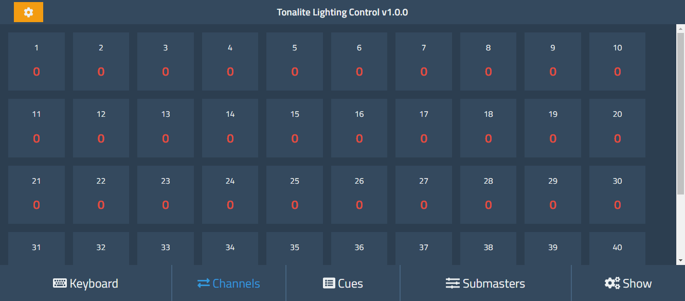
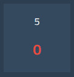
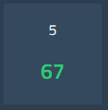

# Using Channels

Channels form the building-blocks of Tonalite. Their values are what get outputted over the network to control the lights. You can view the current channel values by going to the *Channels* tab in the interface.

For each channel there is a box, also known as a tombstone, that displays the *Channel Number* and the *Channel Value*. The *Channel Number* is the smaller number on top, while the *Channel Value* is the larger, colored number on the bottom. Each channel can have a value from `0` to `100`. This value is a percentage of the output of the light which is actually `0` to `255`. 

The *Channel Value* is **red** if the value has not been updated in the last action (setting a channel value, going from cue to cue, or moving a submaster, etc.). It is **green** if the value changed after the last action.

