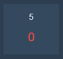

# Using Tonalite Channels

Channels form the building-blocks of Tonalite. Their values are what get outputted to the lights over the network. You can view the current channel values by going to the *Channels* tab in the interface.

For each channel there is a box, also known as a tombstone, that displays the *Channel Number* and the *Channel Value*. The *Channel Number* is the smaller number on top, while the *Channel Value* is the larger, colored number on the bottom.

The *Channel Value* is red if the value has not been updated in the last action (setting a channel value, going from cue to cue, or moving a submaster). It is green if the value changed in the last action.

