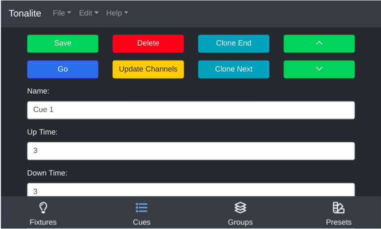

# Cue Settings

You can access the settings for a cue by clicking on it in the list on the `Cues` tab.

## Buttons

### Save

Save the changes you have made to this cue. Make sure you always press this button after making any edits.

### Delete

Remove this cue from the show. You will be prompted to make sure that you really want to do this.

### Clone

Make a duplicate of this cue and place it at the end of the cue list. The new cloned cue will have the same settings and fixture values as the cue that is being cloned.

### Go

Transition to this cue specific cue in the time stated in the cue's `Length` setting.

### Update Channels

Update this cue to use the current values of the show's fixture's channels.

### Up

Move this cue forward in the cue list.

### Down

Move this cue backward in the cue list.

## Inputs

### Name

The name of the cue. You can use this to describe when the cue should be run.

### Up Time

The time it takes for fixture values to change between cues if they are increasing.

### Down Time

The time it takes for fixture values to change between cues if they are decreasing.

### Follow

If this is set to a value greater than `-1`, once the cue has been run, the cue following it will be run after the time specified here (in seconds).