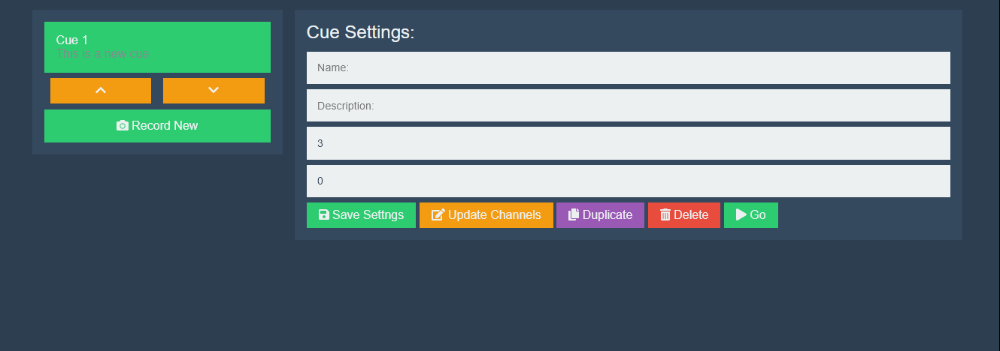

# Editing Cues

Once you have recorded one or more cues, you will see that each as an entry on the lefty side of the *Cues* tab above the *Record New* button. You will also see that two other buttons have appeared: *˄* and *˅*. To edit a cue, click on it's name in the list, it will turn green, and you will see the text boxes to the right of the cues list fill with values.

## Name

This is the name of the selected cue. It can be any length, but it will be truncated to `20` characters when displayed in the control interface.

## Description

This is a description of the selected cue. It can be any length, but it will be truncated to `70` characters when displayed in the control interface.

## Time

This is the amount of time (in seconds) that it will take to transition into the selected cue. This number can be in whole seconds (eg. `3`) or it can also be a decimal (eg. `3.5`).

## Follow

If this is greater than `0`, The selected cue will transition to the next one in line after this amount of time. This number can be in whole seconds (eg. `3`) or it can also be a decimal (eg. `3.5`).

## Save Settings

The *Save Settings* button saves all the changes you have made to the selected cue's *Name*, *Description*, *Time*, and *Follow*.

## Update Channels

The *Update Channels* button replaces the selected cue's channel vales with those that are currently set from the *Keyboard* tab.

## Duplicate

The *Duplicate* button duplicates the selected cue and places the copy at the end of the cue list.

## Delete

The *Delete* button deletes the selected cue from the show.

## Go

If you press the *Go* button, Tonalite will use the selected cue as the active show cue and transition accordingly.