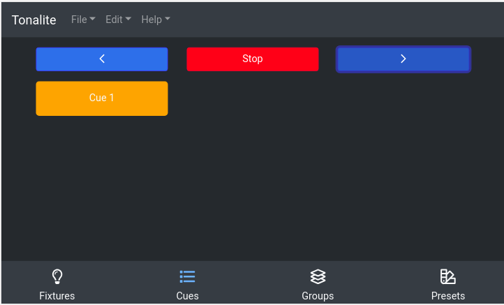

# Moving Between Cues

You transition between cues using the buttons at the top of the `Cues` tab.

## Left

Transition to the cue directly before the current or last-played cue. If no cue has been played or the last cue played was the first in the list, the last cue in the list will be played.

## Right

Transition to the cue directly after the current or last-played cue. If no cue has been played or the last cue played was the last in the list, the first cue in the list will be played.

## Stop

When a cue is running, the `Record` button will switch to a `Stop` button. Press this to stop the currently running cue.