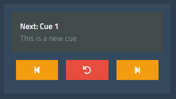

# Using Cues

The standard way of using cues is from the *Keyboard* tab. The cue controls can be found on the left of that tab. First, create some cues as shown in the previous sections.

You will notice that there are thee buttons: *< (Last)*, *Stop*, and *> (Next)*.