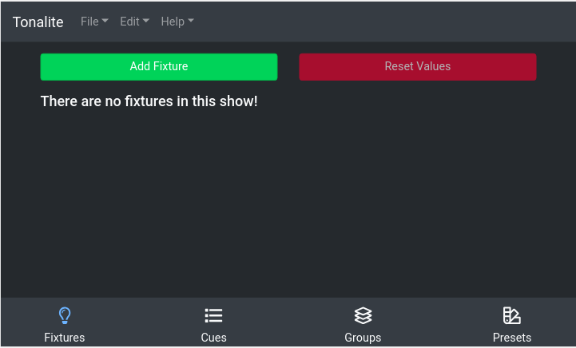

# Using Fixtures

Any production uses a number of different lighting fixtures. Tonalite allows you to control each one individually and set the values of each of its parameters separately. You can access the fixtures in the `Fixtures` tab of the interface.

