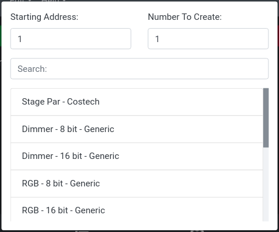

# Adding Fixtures

Add a fixture using the green `Add Fixture` button on the top of the `Fixtures` tab. This will open a modal that shows the available fixture profiles and allows you to set a starting DMX address for the fixture. Each channel's DMX address is based off of the `Starting DMX Address` field. If the fixture has three channels and the starting DMX address is 1, the channels will be mapped to addresses 1, 2, and 3. Use the `Number To Create` field to specify how many of this same type of fixture you would like to create.

To select a fixture profile, click on it in the list, and a new fixture will be created based on this profile.

If a fixture's first channel is intensity, the value will be displayed along with the fixture name on the `Fixtures` tab.