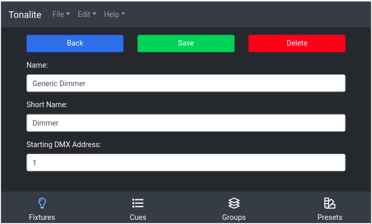

# Changing Fixture Settings

You can change various settings of a fixture.
You can access a fixture's setting page by clicking the `Settings` button on the fixture's parameters page.

## Buttons

### Back

Go back to the fixture's parameters.

### Save

Save the changes you have made to the fixture. Make sure you do this every time you make a change or your edits won't apply!

### Delete

Remove the fixture from the show. You will be prompted to make sure you really want to do this.

## Inputs

### Name

The full name of the fixture. This can be any length needed to be descriptive.

### Short Name

A shorter version of the fixture's name for display in the interface.

### Starting DMX Address

The base DMX address that the parameters for the fixture are based on. See description in `Adding a Fixture`.