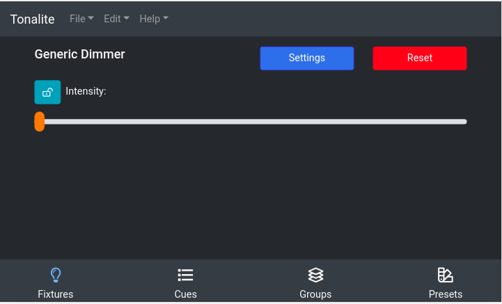

# Updating Fixture Channels

Each of a fixture's channels can be controlled individually. To access the fixture channels page, click on the appropriate fixture in the `Fixtures` tab.

### Lock

Beside each channel there is a lock icon. It switches from unlocked to locked when you click on it. When a channel is locked, the value you set manually on the slider will override values for the channel that are saved in cues.

## Buttons

### Settings

Go to this fixture's settings.

### Reset

Reset the channel values for just this fixture.
