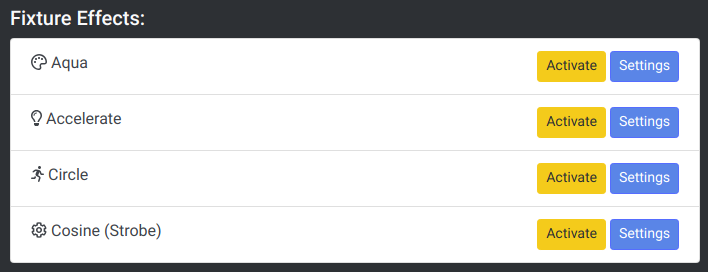
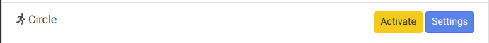
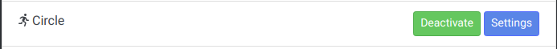

# Fixture Effects

Tonalite supports a number of fixture effects. Each of these fixture effects fall into a specific category based on what parameter(s) of a fixture they control. These cateogories are:

- Color
- Intensity
- Shape
- Parameter

## Effect Display

When a fixture has effects added to it, they are displayed at the bottom of the fixture's parameters page.

## Buttons

### Activate

Activate the selected effect. When pressed, this button turns into a `Deactivate` button. The activation state of all cues on a fixture are saved to cues.

### Deactivate

Deactivate the selected effect. When pressed, this button turns into an `Activate` button. The activation state of all cues on a fixture are saved to cues.

### Settings

Go to this effect's settings.
