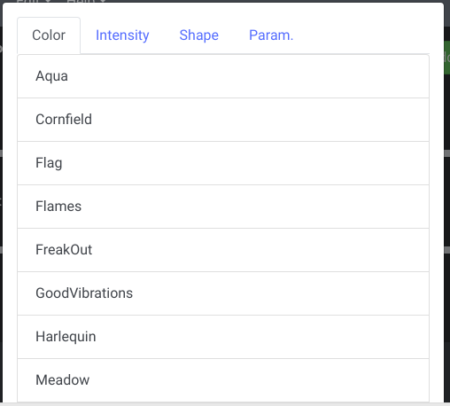
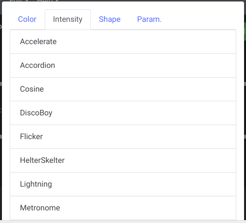
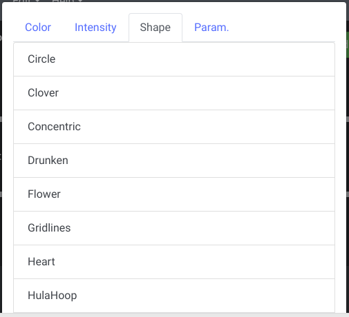
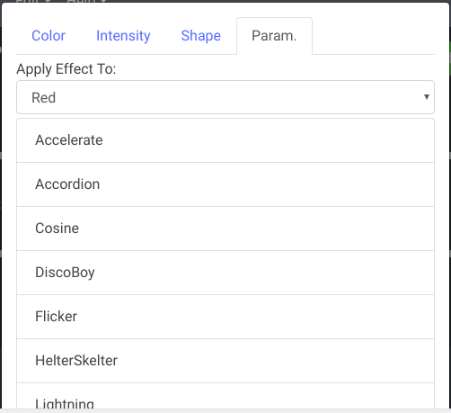

# Adding Effects

Add an effect to the current fixture by using the green `Add Effect` button on the topof the fixture's parameters view. This will open a modal that shows the available effect categories. You can select a category and it will display all the effects aviailable for that category.

## Color

Color effects control the RGB values of a fixture. If more parameter colors than just RGB exist, they will not be affected. If only the R, G, or B parameters exist on the fixture, they will still be affected by themselves.

## Intensity

Intensity effects control the intensity values of a fixture. If an intensity parameter does not exist on the fixture, the effect will have no affect.

## Shape

Shape effects control the pan and tilt values of a fixture (X and Y). If only the pan or tilt parameter exists on the fixture, it will still be affected by itself.

## Param.

Parameter effects control any other value of a fixture. They can however also control color, intensity, and shape parameters as well.

### Apply Effect To

Use the dropdown to select which of this fixture's parameters to apply the parameter effect to.