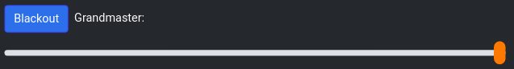

# Grandmaster and Blackout

The grasndmaster and the blackout button are the master overides for the entire lighting system. The only thing they can not control are the presets.

## Grandmaster

The grandmaster controls the final output percentage of the lights. It is in a range of 0-100, and any light values will be output at this percentage of their actual value.

## Blackout

As long as Blackout is active, all DMX output values will be `0`.
