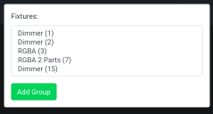

# Adding Groups

Add a group using the green `Add Group` button on the top of the `Groups` tab. This will open a modal that shows the available fixtures in the show and allows you to select which ones you would like to control with this group.

To select a fixture, click on it in the list, and the new group will control this fixture along with any others you select. You can select multiple in this list.

