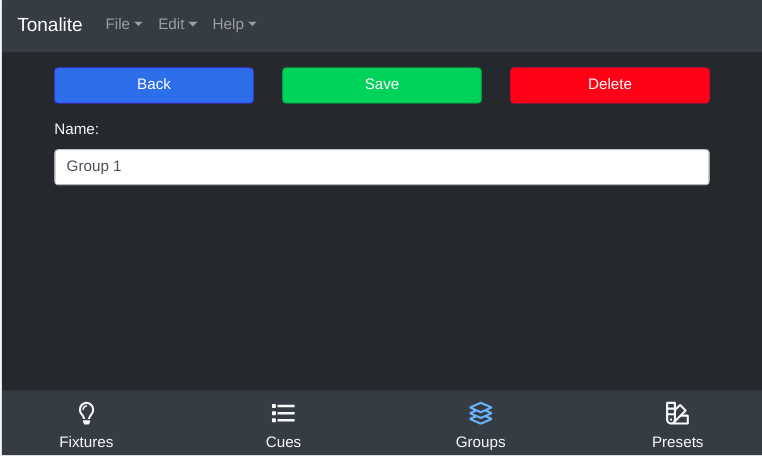

# Changing Group Settings

You can change various settings of a group.
You can access a group's setting page by clicking the `Settings` button on the group's channels page.

## Buttons

### Back

Go back to the group's channels.

### Save

Save the changes you have made to the group. Make sure you do this every time you make a change or your edits won't apply!

### Delete

Remove the group from the show. You will be prompted to make sure you really want to do this.

## Inputs

### Name

The full name of the group. This can be any length needed to be descriptive.

### Short Name

A shorter version of the group's name for display in the interface.
