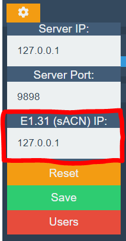

# Configure Your E1.31 (sACN) Interface

You can configure your E1.31 (sACN) DMX interface from the settings box on the Tonalite header. The E1.31 output IP setting is the third input from the top. *Note that the server must be restarted each time you make a change to this value.*

By default, this is set to the local IP of your computer, `127.0.0.1`, but you will have to update this for your interface. Each IP is specific to the interface that you own. If you can not figure out the correct IP to use, contact the interface manufacturer.

### Reset

If you set a custom value for the E1.31 (sACN) IP and can't remember what the default value was, just press the yellow *Reset* button and the default value will be entered. Then, simply press the green *Save* button to use that value.
