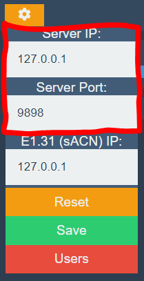

# Configure the Tonalite Server

You can configure the Tonalite serve from the settings box on the Tonalite header. The server output IP and port settings are the first and second inputs from the top, respectively. *Note that the server must be restarted each time you make a change to these values.*

### Server IP

This is the output IP address that the Tonalite server will stream the client to. By default, this is set to the local IP of your computer, `127.0.0.1`, but if you would like to use the Tonalite interface from another device, this will have to match the IP address of your internet connection. You may also need to change this if it clashes with another service on your computer that needs to use that IP address.

### Server Port

This is the IP port on which the Tonalite server will stream the client to. By default, this is set to `9898` so as not to clash with any other processes that may be using the same IP address, buy you may have to change this if you experience problems.

### Fallback

If you have set custom values for the Server IP and Port and the Tonalite server has trouble connecting, it will fallback to the default values and try again.

### Reset

If you have set custom values for the Server IP and Port and can't remember what the default values where, just press the yellow *Reset* button and the default values will be entered. Then, simply press the green *Save* button to use those values.
