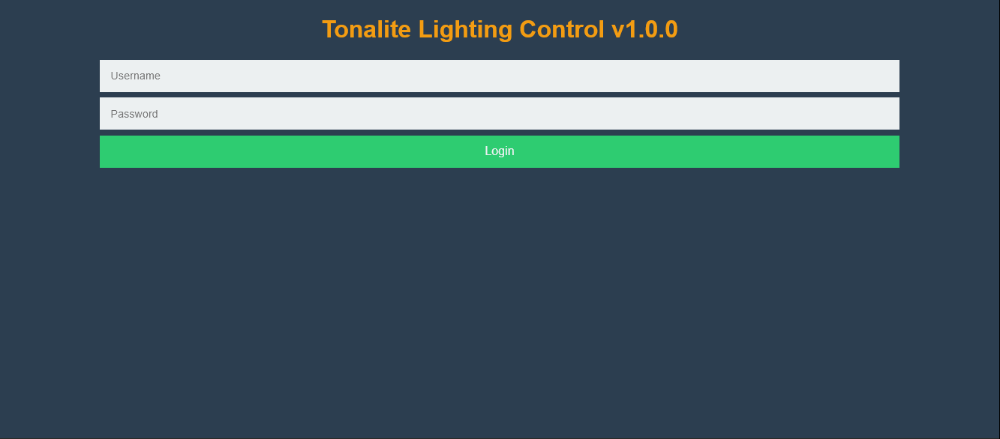

# Logging Into Tonalite

The Tonalite login page is the first thing any user will encounter when trying to access the control interface. This protects your system from unwanted operators who may mess up the lighting.

## Default Login

By default, Tonalite has one user. The default username and password are

Username: `admin`

Password: `password`

These can be changed after you login the first time, or you can leave them as they are if security is not an issue for your system.