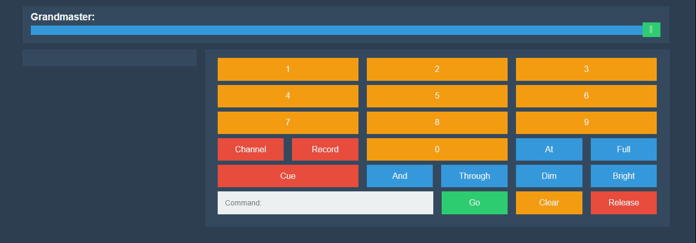
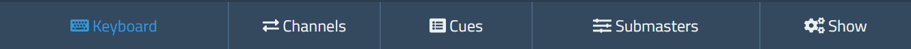

# The Tonalite Interface

The Tonalite control interface is made up of three seperate sections. Each holds different controls for different uses.

## Header

The header section is where the configuration is accessed, and where you can see what version of Tonalite you are running.

## Content

The content section holds different controls based on which tab in the footer you are on.

## Footer

The footer holds the different tabs used for accessing different controls.

There are 5 different tabs:

- Keyboard
- Channels
- Cues
- Submasters
- Show
