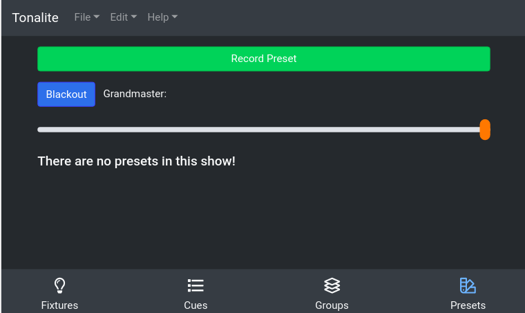

# Using Presets

When used for a permanent installation, there needs to be a way for users who don't have experience with the program to turn on lights. Tonalite allows you to set up presets which are one-click overrides that allow easy control of chosen lights.

On the presets page, tab a preset to turn it on (it will turn red) and tap again to turn it off (it will go back to purple).
