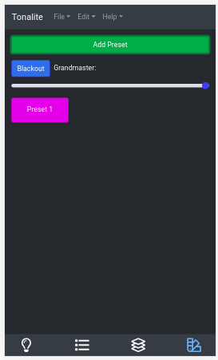

# Adding Presets

Add a preset using the green `Add Preset` button on the top of the `Presets` tab. The preset will store the current DMX output values for recall.

To edit a preset's settings, tap on it in this list.