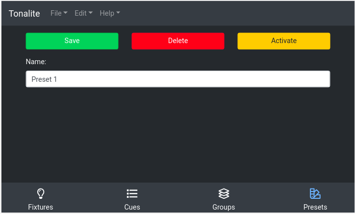

# Changing Preset Settings

You can change various settings of a preset.
You can access a preset's setting page by clicking on a preset item on the `Presets` page.

## Buttons

### Save

Save the changes you have made to the preset. Make sure you do this every time you make a change or your edits won't apply!

### Delete

Remove the preset from the show. You will be prompted to make sure you really want to do this.

### Activate

Active the current preset. When activated, this button witll switch to `Deactivate` which does the opposite.