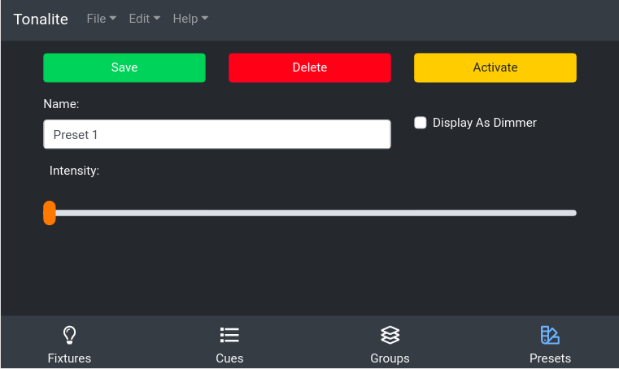

# Changing Preset Settings

You can change various settings of a preset.
You can access a preset's setting page by clicking on a preset item on the `Presets` page.

## Buttons

### Save

Save the changes you have made to the preset. Make sure you do this every time you make a change or your edits won't apply!

### Delete

Remove the preset from the show. You will be prompted to make sure you really want to do this.

### Activate

Active the current preset. When activated, this button witll switch to `Deactivate` which does the opposite.

## Inputs

### Name

The full name of the preset. This can be any length needed to be descriptive though you should keep it short enough so as to fit into the interface easily.

### Display As Dimmer

Display the preset as a dimmable value rather than as an on/off button in the interface.

### Intensity

Control the overall intensity of this preset.