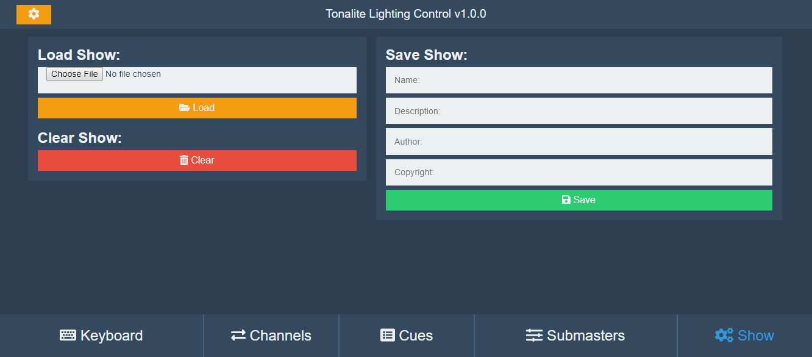

# Show Settings

The settings for the current show ca be found in the *Show* tab in the interface.

## Load Show

### Show File

The file in which all of the show settings are stored.

### Load

Upload the show file and set the show settings to match.

## Save Show

The only fild that is neccessary is the *Name* field.

### Name

The name of the current show.

### Description

A description of the current show.

### Author

The author(s) of the current show.

### Copyright

The copyright of the current show.

### Save

Save the current show items (cues, submasters) and download them as a new show file.

## Clear Show

The *Clear* button removes all show items (cues, submasters) and resets all values to default.
