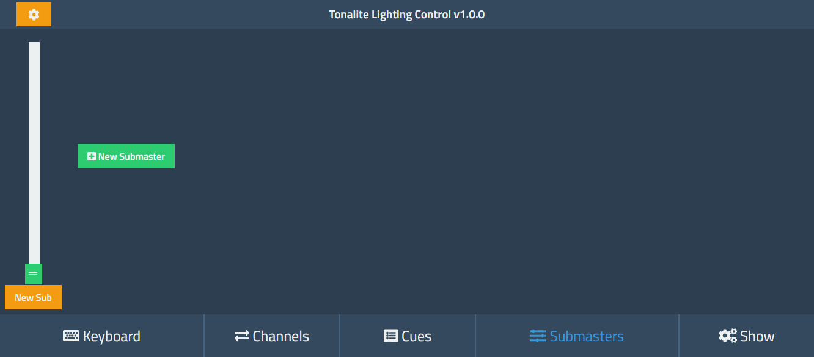

# Creating Submasters

To create a new submaster, press the *New Submaster* button.

A new submaster will be created and displayed before the *New Submaster* button. If there are other submasters, the new one will be displayed after all others (to the right).

