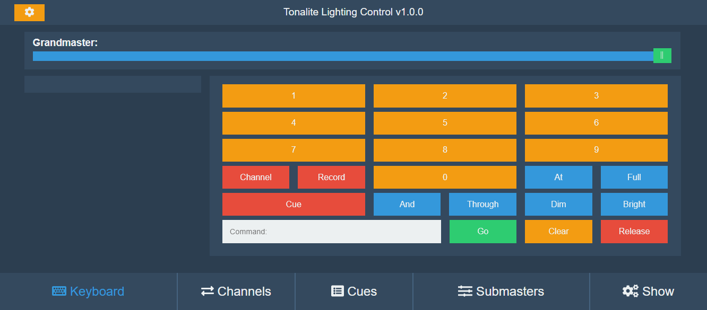

# Setting Channel Values

To set the values of different channels, use the *Keyboard* tab in the control interface. Channel values entered from the *Keyboard* tab overwrite all other channel values from *Cues* and *Submasters*.

## Set a single value

To set a single channel's value, press the *Chanel* button then the channel number you would like to control, then the *At* button and then the value of the channel. Finally, press the *Go* button.

To set Channel 1 at 50%, you would press:

`Channel` + `1` + `At` + `50` + `Go`

## Set multiple values

To set multiple channel's values, do the same as above, except this time use the *And* and *Through* buttons.

### And

The *And* button allows you to set the values of multiple channels out of order.

To set Channel 1, 3, and 5 at 75%, you would press:

`Channel` + `1` + `And` + `3` + `And` + `5` + `At` + `75` + `Go`

### Through

The *Through* button allows you to set the values of many channels in a row.

If you want to set Channels 1 through 25 at 25%, instead of using the *And* button and entering each channel one-by-one, just press:

`Channel` + `1` + `Through` + `25` + `At` + `25` + `Go`
