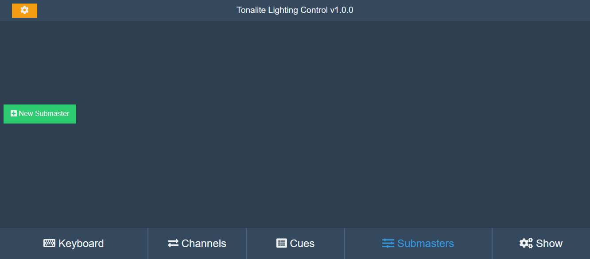

# Using Submasters

Submasters are sliders that you can configure to control different combinations of channels for easy access. The submaster controls can be found in the *Submaster* tab in the interface. Tonalite supports an unlimited number of submasters.

