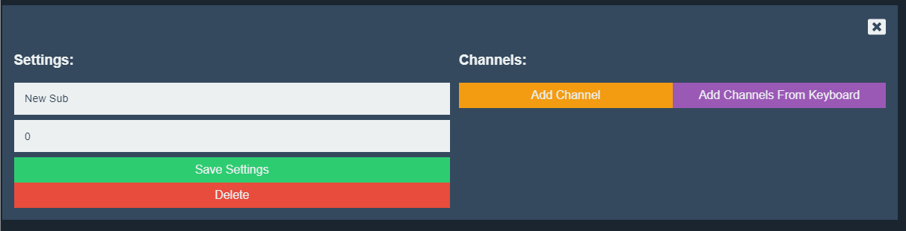

# Editing Submasters

To edit a submaster, click on its name benith the slider.

A window will pop up that holds the settings for the selected submaster.

## Name

The *Submaster Name* can be be as long as you would like, but it will be truncated to `12` characters when displayed in the interface.

## Value

This is the value (in percents) of the submaster slider. All channels controlled by the current submaster will have their output set at this percent of their value.

## Save Settings

Save and update the *Name* and *Value* for the current submaster.

## Delete

Delete the current submaster from the show.